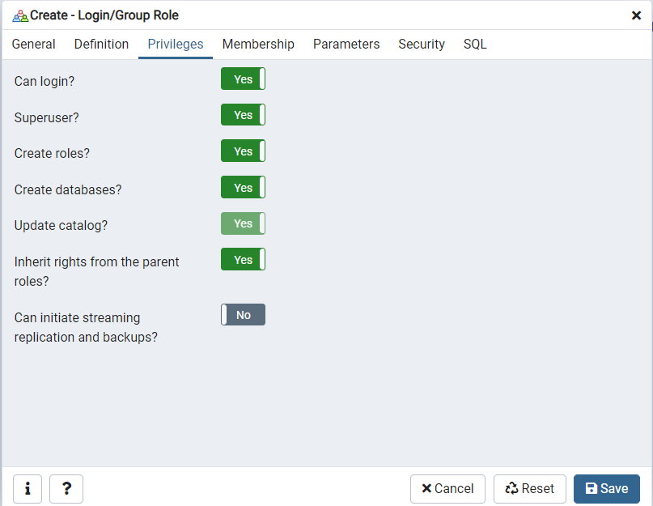
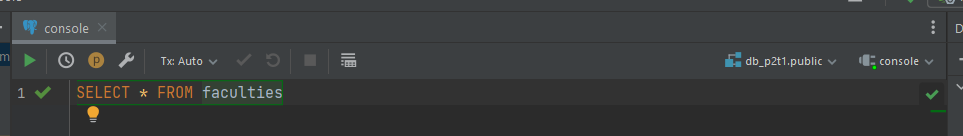
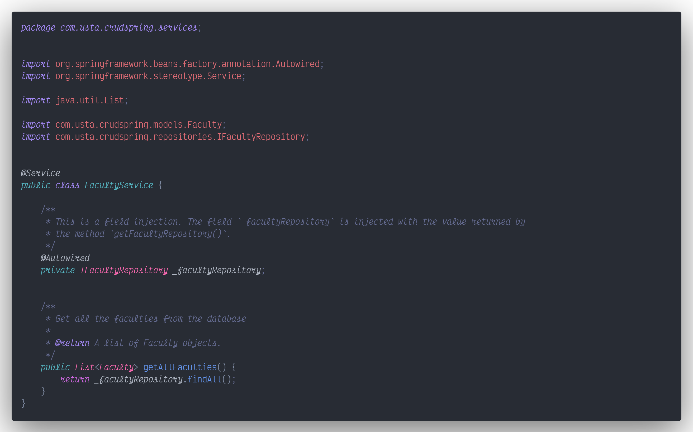

# CRUD con Spring

## Creación de Proyecto

Creamos un nuevo proyecto con ***IntelliJ IDEA Ultimate***:

## Spring Initializer

Luego, seleccionamos ***Spring Initializer*** para configurar el nombre, ubicación, lenguaje, tipo, grupo, artifact, package name, versión de Java, y empaquetado del proyecto, y pulsamos Next.

> En caso de no contar con la opción de ***Spring Initializer***, debemos instalar un plugin desde la vista inicial de ***IntelliJ IDEA Ultimate***, o yendo a la pestaña de **File > Settings**, en la vista de **Plugins** y buscando el plugin ***Spring Initializr and Assistant***
>
> 
>
>

## Selección de Dependencias

Luego, seleccionamos las siguientes dependencias para nuestro proyecto:

- Spring Web
- Spring Data JPA
- PostgreSQL Driver

Presionamos Finish para que IntelliJ abra el proyecto en una nueva ventana.

## Database en PostgreSQL

### Nuevo usuario (opcional)

Vamos a crear una nuevo usuario en PostgreSQL para el acceso desde Spring. Este es un paso opcional, pero recomendado.

### Database

Creamos una nueva base de datos, en mi caso he decidido llamarla `db_p2t1`, y le asigne el usuario `user_spring`:

### DDL (Data Definition Language)

Vamos a definir 2 tablas dentro de nuestra base de datos:

### DML (Data Manipulation Language)

Añadimos nuevas filas dentro de cada tabla:

### Puerto del Servidor

Necesitamos estar seguros de en que puerto está corriendo nuestro servidor de PostgreSQL, por lo tanto debemos acceder a las propiedades del servidor, e ir a la pestaña de conexión:

## Añadir un DataSource al proyecto

En la interfaz del programa, podemos seleccionar la pestaña ***Database***, para añadir una nueva base de datos desde el signo de `+`. Como estamos usando PostgreSQL seleccionamos la fuente del mismo.

Una vez seleccionada la DataSource de PostgreSQL, debemos añadir el Host, Puerto, Usuario y Contraseña, y el nombre de la base de datos a la que nos vamos a conectar. Es importante presionar en la opción de **Test Connection** para poder saber si los datos que ingresamos son correctos. Una vez estemos seguros, entonces podemos presionar en OK.

Una vez terminada la configuración de la base de datos, podemos observar un estructura de árbol con la conexión de nuestra base de datos.

## Hacer consultas a la DB desde IntelliJ

Cuando estamos en la pestaña de Database, tenemos disponible una consola para hacer consultas, lo primero que podemos hacer, es una consulta manual.

El resultado que obtenemos en la parte inferior es la siguiente:

También podemos hacer consultas de manera automática, al presionar click derecho sobre una tabla e ir a la sección de **SQL Scripts**, en donde tenemos una serie de consultas disponibles.

Por ejemplo, seleccione la consulta **Select all rows from a table**, e inmediatamente aparece la siguiente consulta en la consola:

Ejecutamos la consulta, y este es el resultado:

## Hacer un Build al proyecto

Dentro de IntelliJ podemos hacer un build de nuestro proyecto, algo muy similar al script `build` que ejecutábamos en un proyecto de Node. Para ello, podemos presionar cualquiera de las siguientes opciones:

- Podemos acceder a la pestaña **Build** y seleccionar **Build Project**
  
  

- En la parte superior derecha tenemos la opción de hacer un build mediante el botón con el icono de un martillo

  

- En la parte inferior, también podemos encontrar la opción de **Build** y presionamos de nuevo en el icono del martillo.
  
  

La salida que obtendremos en cualquiera de las opciones, será la siguiente:

## Ejecutar el proyecto

Para correr nuestro proyecto tenemos de nuevo varias opciones:

- Podemos acceder a la pestaña **Run** y seleccionar **Run**, ya sea con el proyecto o seleccionándolo de manera manual
  
  

- En la parte superior derecha tenemos la opción de Run mediante el botón con el icono de Play
  
  

En la parte inferior, también podemos encontrar la opción de **Run** y presionamos de nuevo en el icono de Play.
  
  

Actualmente, la salida que vamos a tener será la siguiente:

## Configurar las propiedades de la aplicación

Necesitamos ingresar al archivo `src/main/resources/application.properties` y configurar los siguientes datos:

Luego, podemos hacer un Build y Run al proyecto y obtendremos la siguiente salida:

## Paquete: Modelos

Vamos a crear un nuevo paquete que nos servirá para almacenar las entidades de nuestro proyecto, las cuales se van a conectar a la base de datos, y por la configuración establecida en el archivo `application.properties`, se actualizarán las tablas con lo que configuremos en nuestra entidad.

Dentro del nuevo paquete, añadimos una nueva clase modelo:

En Spring usamos muchas ***Anotaciones***, las cuales se identifican por el signo `@`. En esta clase, para definir una entidad, debemos usar la anotación `@Entity`. Mediante `@Table`, definimos la tabla de la base de datos a la que apunta.

## Paquete: Repositorios

Creamos un nuevo paquete y una interfaz dentro del mismo, para poder manejar los repositorios a implementar en nuestros servicios.

En este primer repositorio tendremos el siguiente contenido:

## Paquete: Servicios

Creamos un nuevo paquete con una clase dentro del mismo.

Usamos la anotación `@Service` para que Spring lo reconozca como un servicio, y hacemos una inyección de dependencias del repositorio, con la anotación `@Autowired`. Nuestro primer servicio, será listar todas las facultades.

## Paquete: REST

Creamos un nuevo paquete para poder llamar todos nuestro servicios:

En la clase de su interior definimos que es un controlador de tipo REST, mediante la anotación `@RestController`, y definimos el endpoint base del proyecto con la anotación `@RequestMapping`. Inyectamos nuestro servicio, para luego usar el método de obtener todas las facultades. El endpoint para dicho método se define con la anotación `@GetMapping`

## Prueba del endpoint

Podemos hacer la prueba a nuestro servicio mediante Postman:

## Servicio para obtener un registro por ID

Ya sea dentro de la entidad `Faculty` o `Professors`, tenemos un campo de Id en cada uno. Lo que queremos hacer es crear un servicio que nos permita traer un registro por su id. Para ello creamos el siguiente método dentro de cualquiera de los servicios, por ejemplo para las docentes:

## Método REST para obtener por ID

Ahora, dentro de los métodos REST para los docentes, creamos un endpoint para acceder mediante método GET, pero trayendo una parámetro. Para ello usamos las anotaciones `@GetMapping` y `@PathVariable`:

## Servicio para postear un registro

Dentro de los servicios, queremos postear un nuestro registro, para lo cual creamos un método que reciba un parámetro del tipo de entidad a crear, y luego guardamos el registro. Por ejemplo, en el caso de los docentes:

## Método REST para crear

En los métodos REST respectivos a la entidad, creamos una función que nos permite recibir por el body los datos del registro a crear. Si todo va bien, entonces retornamos una respuesta con una consulta por id, pero si algo sale mal retornamos un código de status de BAD_REQUEST. Este es el caso para los docentes.

Dentro del Api Client POSTMAN, hacemos la prueba para este servicio en el caso de las facultades y los docentes:

