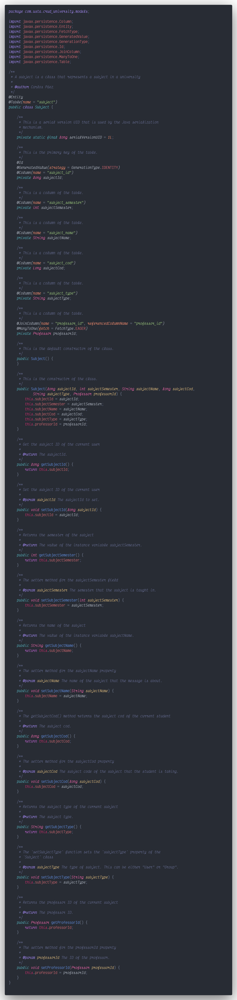
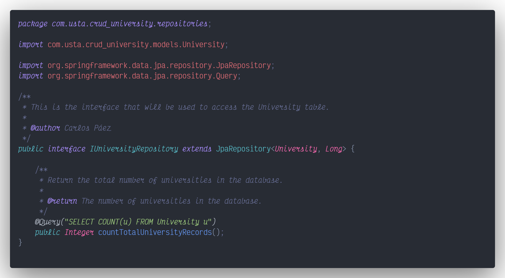
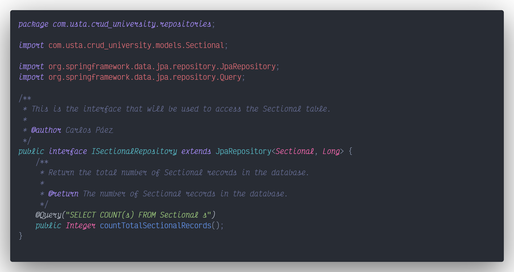
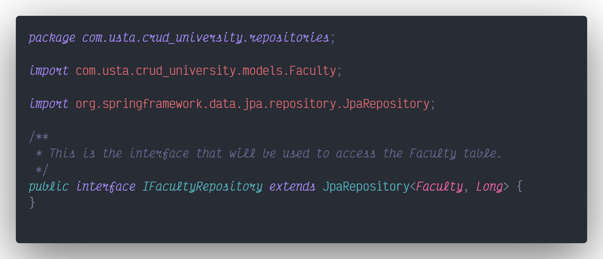
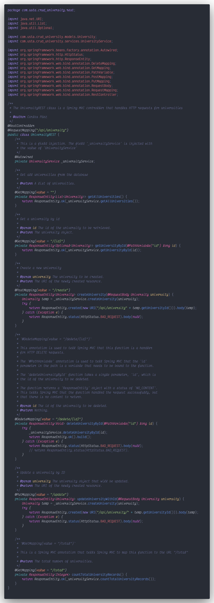
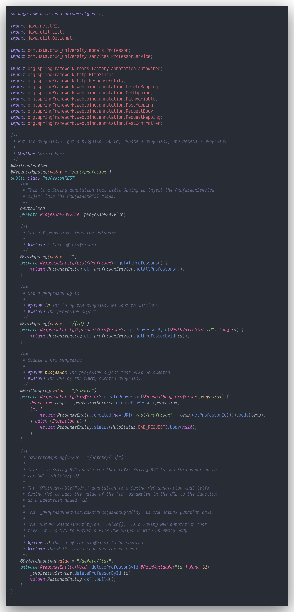

# CRUD University

Creamos un nuevo proyecto en IntelliJ IDEA con Spring Initializer, en el que añadimos las dependencias de ***Spring Web***, ***Spring Data JPA*** y ***PostgreSQL Driver***.

## Base de datos

Creamos una nueva base de datos dentro de PostgreSQL:

### DDL (Data Definition Language)

### DML (Data Manipulation Language)

## Conectar la base de datos con IntelliJ

## Conectar el proyecto con la DB

## Build y Run del proyecto

## Modelos

### Model - Universidad

### Model - Seccional

### Model - Facultad

### Model - Docente

### Model - Asignatura

## Repositorios

### Repository - Universidad

### Repository - Seccional

### Repository - Facultad

### Repository - Docente

### Repository - Asignatura

## Servicios

### Service - Universidad

### Service - Seccional

### Service - Facultad

### Service - Docente

### Service - Asignatura

## REST

### REST - Universidad

### REST - Seccional

### REST - Facultad

### REST - Docente

### REST - Asignatura

## API Client - Postman

En el siguiente enlace se puede ver la documentación de las peticiones dentro de POSTMAN: [P2T2_CRUD_University Peticiones](https://documenter.getpostman.com/view/8438809/UVyuRa1L)
