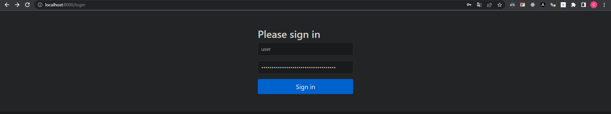

# JWT

Instalamos las dependencias ***Lombok***, ***Spring Web*** y ***Spring Security***. Puede ser que nos aparece un a advertencia de habilitar la dependencia de Lombok, por lo que aceptamos dicha opción.

En caso de ser necesario, cambiamos el puerto del proyecto dentro del archivo `resources/application.properties`.

```txt
server.port = 8000
```

Cuando hacemos un build and run de nuestro proyecto, se nos va a generar un usuario y una contraseña por defecto, las cuales serán empleadas en la dirección `http:/localhost:8000/login`. En mi caso, el usuario por defecto es `user` y la contraseña fue `f324a235-ef0b-488f-8c26-230296e36d58`:



Dentro de la carpeta `resource` creamos un archivo llamado `application.yml`.
